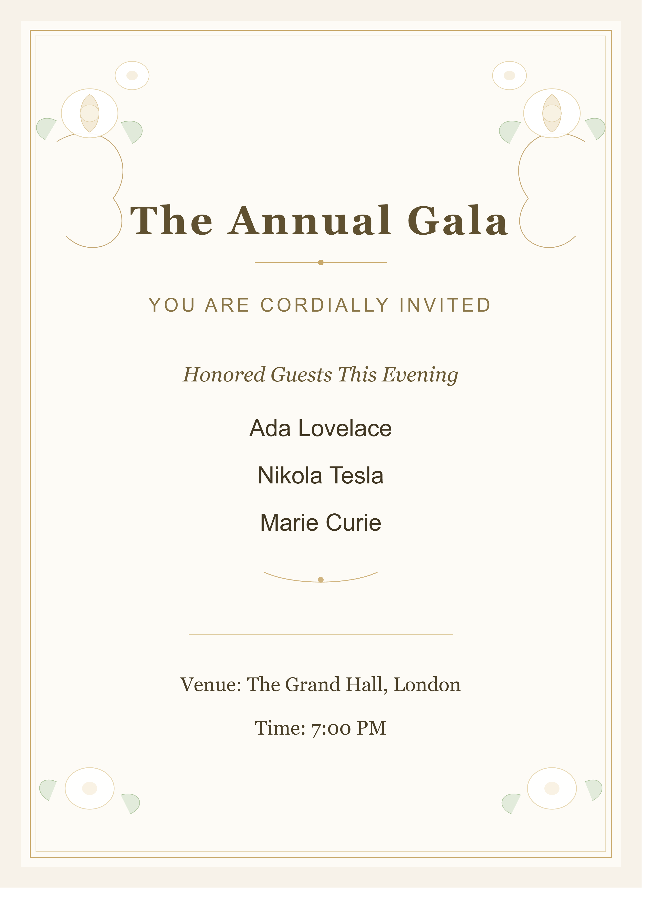
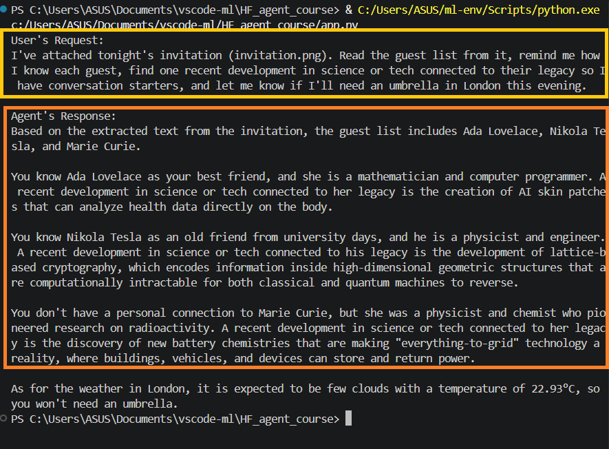

# Multimodal Agentic RAG Assistant

A tool-using AI agent built with **LangGraph** that reads images, retrieves from a hybrid document index, searches the web, and calls live APIs, deciding on its own which tools to use for any request, then synthesizing the results into a single coherent answer.

The system pairs a **hybrid retriever** (keyword + semantic), **real API integrations** (Tavily web search, live OpenWeatherMap), a **vision tool** that reads text from images (making it multimodal), and a **Groq-hosted LLM** driving the reasoning loop.

---

## What it does

Given a natural-language request, optionally referencing an image - the agent reasons about what information it needs and calls the right tools automatically.

Example request (all four tools in one turn):

> *"I've attached tonight's invitation (invitation.png). Read the guest list from it, remind me how I know each guest, find one recent development in science or tech connected to their legacy so I have conversation starters, and let me know if I'll need an umbrella in London this evening."*

The agent:

1. **Reads the image** (`extract_text`) → extracts the guest names from the invitation.
2. **Retrieves guest info** (`guest_info_tool`) → recalls how you know each guest from the local guest notes.
3. **Searches the web** (`search_tool`) → finds a recent science/tech development to seed conversation.
4. **Checks the weather** (`get_weather_info`) → reports London conditions for the umbrella question.

All four results are woven into one natural response the tools disappear, the answer just feels helpful.

---

## Multi-tool orchestration

The agent doesn't follow a fixed pipeline, it decides which tools to call and in what order based on the request. A single query can trigger one tool or all four, chained automatically:

```
vision → retrieval → web search → weather
```

The LLM chooses the tools itself; there is no hardcoded routing.

---

## Demo

**The input image** (`invitation.png`):

<p align="center">
  
</p>

**Request:**

```
I've attached tonight's invitation (invitation.png). Read the guest list from it,
remind me how I know each guest, find one recent development in science or tech
connected to their legacy so I have conversation starters, and let me know if
I'll need an umbrella in London this evening.
```

**Response (abridged):**

```
Based on the extracted text from the invitation, the guest list includes
Ada Lovelace, Nikola Tesla, and Marie Curie.

You know Ada Lovelace as your best friend, a mathematician and computer
programmer. A recent development connected to her legacy is ...

You know Nikola Tesla as an old friend from university days, a physicist and
engineer. A recent development connected to his legacy is lattice-based
cryptography ...

You don't have a personal connection to Marie Curie, but she was a physicist
and chemist who pioneered research on radioactivity. A recent development
connected to her legacy is new battery chemistries ...

As for the weather in London, it is expected to be few clouds at 22.93°C,
so you won't need an umbrella.
```

**Actual run:**

<p align="center">
  
</p>

Vision → retrieval → web search → live weather, all in one coherent answer.

---

## Architecture

The agent is a **ReAct-style agent** implemented as a LangGraph state machine. The graph loops between a reasoning node and a tool-execution node until the LLM has everything it needs to answer.

```
        ┌─────────────┐
        │    START    │
        └──────┬──────┘
               │
               ▼
        ┌─────────────┐   needs a tool?   ┌─────────────┐
        │  assistant  │ ────────────────► │    tools    │
        │  (LLM node) │ ◄──────────────── │  (executes) │
        └──────┬──────┘   returns result  └─────────────┘
               │
               │ no tool needed
               ▼
          final answer
```

- **assistant node** — the Groq LLM with all tools bound to it. It reads the conversation and decides whether to answer directly or call a tool.
- **tools node** — a LangGraph `ToolNode` that runs whichever tool the LLM requested and feeds the result back.
- **conditional edge** — `tools_condition` routes to the tools node when the LLM asks for a tool, otherwise ends the turn.

State flows through the graph as a growing message list, using LangGraph's `add_messages` reducer so every turn's messages accumulate rather than overwrite.

---

## The tools

### 1. Vision — extract text from images (multimodal)

Reads text from an image file (an invitation, note, menu, or any picture with text) using a multimodal vision model (`llama-4-scout` via Groq). The image is base64-encoded and sent as a multimodal message. This is what makes the system multimodal, it accepts images as well as text.

### 2. Guest retriever — Hybrid BM25 + FAISS

The centerpiece. Instead of a single retrieval method, it combines two:

- **BM25** — keyword/lexical matching (good for exact names and terms)
- **FAISS + sentence-transformers** (`all-mpnet-base-v2`) — dense semantic matching (good for meaning and paraphrase)

These are fused with an **EnsembleRetriever** weighted **0.3 (BM25) / 0.7 (semantic)**, so semantic understanding leads while keyword matching keeps precise-term queries grounded.

**Why hybrid matters — a concrete result:** on a query where BM25 alone ranked Ada Lovelace *last*, the semantic-weighted hybrid moved her to *first*. Combining lexical and semantic signals produced noticeably better ranking than either method alone.

### 3. Web search — Tavily

A live web-search tool (Tavily, purpose-built for LLM agents) that pulls current, real-world information beyond the local guest notes — recent news, extra detail, conversation starters.

### 4. Weather — OpenWeatherMap

A real weather tool calling the OpenWeatherMap API, returning live conditions and temperature for any city, with error handling for unknown cities and network failures.

---

## Sample guest data

The retriever searches over a small guest list. Each entry has a name, your relation to them, a description, and an email:

| Name | Relation | Description |
|------|----------|-------------|
| Ada Lovelace | best friend | Esteemed mathematician, celebrated as the first computer programmer for her work on Babbage's Analytical Engine. |
| Dr. Nikola Tesla | old friend from university days | Recently patented a new wireless energy transmission system; passionate about pigeons. |
| Marie Curie | no relation | Groundbreaking physicist and chemist, famous for her research on radioactivity. |

The hybrid retriever matches against these descriptions, so a query like "tell me about my mathematician friend" finds Ada even without her name.

---

## Tech stack

- **LangGraph** — agent orchestration (state graph, ReAct loop)
- **LangChain** — tool abstractions, retrievers, document handling
- **Groq** — LLM inference (`llama-3.3-70b-versatile` for reasoning, `llama-4-scout` for vision)
- **FAISS** + **sentence-transformers** — semantic retrieval
- **BM25** — lexical retrieval
- **Tavily** — web search
- **OpenWeatherMap** — live weather

---

## Project structure

```
agentic-rag/
├── app.py           # builds the LangGraph agent, binds tools, runs it
├── retriever.py     # hybrid BM25 + FAISS guest retriever tool
├── tools.py         # vision, web search, and weather tools
├── invitation.png   # sample image for the multimodal demo
├── .env             # API keys (not committed)
├── requirements.txt # pinned working versions
└── README.md
```

---

## Setup

1. **Clone and create a virtual environment**

   ```bash
   python -m venv ml-env
   # Windows
   ml-env\Scripts\activate
   # macOS/Linux
   source ml-env/bin/activate
   ```

2. **Install dependencies**

   ```bash
   pip install -r requirements.txt
   ```

3. **Add your API keys** to a `.env` file in the project root:

   ```
   GROQ_API_KEY=your_groq_key
   TAVILY_API_KEY=your_tavily_key
   WEATHER_API_KEY=your_openweathermap_key
   ```

4. **Run**

   ```bash
   python app.py
   ```

---

## Highlights

- **Multimodal** — a vision tool lets the agent read text from images, not just text input.
- **Hybrid retrieval** — a BM25 + FAISS ensemble with tuned weighting, with a measurable ranking improvement over either method alone.
- **Real API integrations** — live Tavily web search and OpenWeatherMap weather, not mocked responses.
- **Fast inference** — Groq-hosted Llama 3.3 70B for reasoning and Llama-4-Scout for vision.
- **Autonomous tool selection** — the LLM decides which tools to call and in what order; no hardcoded routing.

---

## Notes

This is a learning-and-portfolio project demonstrating multimodal agentic RAG patterns, not a production system.
